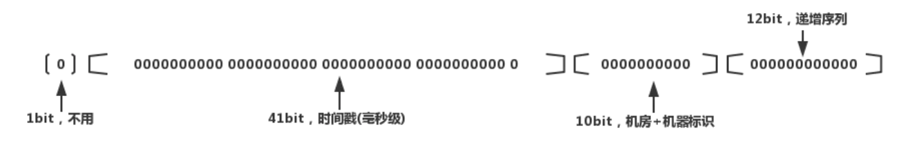

### 常见的一些问题和设计场景

1. 秒杀系统设计
    - [秒杀系统设计](https://www.zhihu.com/question/54895548/answer/146924420)
    - [秒杀系统设计](https://zhuanlan.zhihu.com/p/23176714)
    - [秒杀系统设计](https://zhuanlan.zhihu.com/p/57644774)

2. 游戏排名系统
    - [游戏排名](https://zhuanlan.zhihu.com/p/50770947)
    - [游戏排名](https://www.cnblogs.com/tudas/p/algorithm-on-game-rank-list.html)
    - [游戏排名](https://blog.codingnow.com/2014/03/mmzb_db_2.html)
    - [游戏排名](https://www.cnblogs.com/nagi/p/4172580.html)

3. 抽奖概率算法
    - 场景描述：某游戏要举办一个抽奖活动，每个玩家都有30%的概率获得奖品，奖品只有k个，每个人的抽奖都是独立的，抽奖方式为与游戏NPC进行对话，然后便可以得知自己是否获奖，问如何使用最少的系统资源完成每个用户的抽奖？
    - 分析：每个用户的抽奖是独立的，则核心问题是如何安排每一个用户的抽奖，保证抽奖概率，那么思路很简单，随机产生 0-9 10个数，如果小于3则中奖，否则不中奖，另外，题目要求资源消耗小，分析系统我们发现，用户的抽奖实际上是一个数据流动的过程，我们不可能等到最后一次性处理所有用户的抽奖，实际上这个抽奖是实时的，那么思路就很明确了，我们维护两个数，一个数保存当前正在抽奖的客户的UID，另一个保存生成的随机数，然后判断当前用户数据能否中奖。

4. 生成全局ID
    - 场景描述：在许多条件中，如餐饮，酒店，支付等场景中，往往需要生成一个全局id来唯一表示一条记录，而且这种系统往往是分布式，那么我们如何保证生成的ID是全局唯一的呢？
    - 条件
    1. 全局唯一性：不能出现重复的ID，最基本的要求。
    2. 趋势递增：MySQL InnoDB引擎使用的是聚集索引，由于多数RDBMS使用B-tree的数据结构来存储索引数据，在主键的选择上面我们应尽量使用有序的主键保证写入性能。
    3. 单调递增：保证下一个ID一定大于上一个ID。
    4. 信息安全：如果ID是连续递增的，恶意用户就可以很容易的窥见订单号的规则，从而猜出下一个订单号，如果是竞争对手，就可以直接知道我们一天的订单量。所以在某些场景下，需要ID无规则。

    - 解决方案
        - Reference
        - [分布式全局唯一ID生成策略](https://www.jianshu.com/p/9d7ebe37215e)
        - [全局唯一ID生成策略](https://www.zhihu.com/search?type=content&q=%E5%85%A8%E5%B1%80ID%E7%94%9F%E6%88%90)
    1. UUID
    > UUID是指在一台机器在同一时间中生成的数字在所有机器中都是唯一的。按照开放软件基金会(OSF)制定的标准计算，用到了以太网卡地址、纳秒级时间、芯片ID码和许多可能的数字

    - UUID由以下几部分的组合：

        - 当前日期和时间。
        - 时钟序列。
        - 全局唯一的IEEE机器识别号，如果有网卡，从网卡MAC地址获得，没有网卡以其他方式获得。

    - 标准的UUID格式为：
    xxxxxxxx-xxxx-xxxx-xxxx-xxxxxxxxxxxx (8-4-4-4-12)，以连字号分为五段形式的36个字符
    - 示例：550e8400-e29b-41d4-a716-446655440000
    许多类库中已经提供了UUID的API。
    - 优点:性能非常高：本地生成，没有网络消耗。
    - 缺点:
        - 不易存储：UUID太长，16字节128位，通常以36长度的字符串表示，很多场景不适用。
        - 信息不安全：基于MAC地址生成UUID的算法可能会造成MAC地址泄露，这个漏洞曾被用于寻找梅丽莎病毒的制作者位置。
        - ID作为主键时在特定的环境会存在一些问题，比如做DB主键的场景下，UUID就非常不适用。

    2. SnowFlake雪花算法
    > 雪花ID生成的是一个64位的二进制正整数，然后转换成10进制的数。64位二进制数由如下部分组成：
        
    - 1位标识符：始终是0，由于long基本类型一般是带符号的，最高位是符号位，正数是0，负数是1，所以id一般是正数，最高位是0
    - 41位时间戳：41位时间截不是存储当前时间的时间截，而是存储时间截的差值（当前时间截 - 开始时间截 )得到的值，这里的的开始时间截，一般是我们的id生成器开始使用的时间，由我们程序来指定的
    - 10位机器标识码：可以部署在1024个节点，如果机器分机房（IDC）部署，这10位可以由 5位机房ID + 5位机器ID 组成
    - 12位序列：毫秒内的计数，12位的计数顺序号支持每个节点每毫秒(同一机器，同一时间截)产生4096个ID序号

    - 优点：
        - 简单高效，生成速度快。
        - 时间戳在高位，自增序列在低位，整个ID是趋势递增的，按照时间有序递增。
        - 灵活度高，可以根据业务需求，调整bit位的划分，满足不同的需求
    - 缺点：
        - 依赖机器的时钟，如果服务器时钟回拨，会导致重复ID生成。
        - 在分布式环境上，每个服务器的时钟不可能完全同步，有时会出现不是全局递增的情况。
    
5. 朋友圈设计

6. 视频网站的设计

 